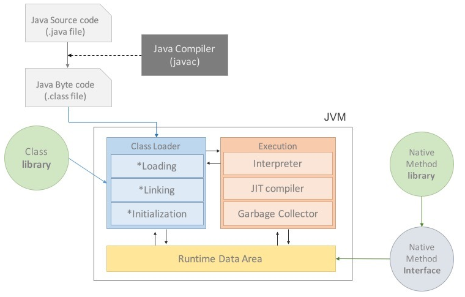

JVM
===

</img>  

### JVM이란?

JVM(Java Virtual Machine)은 자바 가상 머신의 약자로 운영체제로부터 메모리를 할당받아 자바 기반 애플리케이션을 실행하는 역할을 한다.

JVM이 운영체제 위에서 동작하기 때문에 자바 기반 애플리케이션은 운영체제에 독립적이라는 장점이 있다.

 

### JVM 구성

- **Class Loader**  
  런타임 시점에 바이트코드(.class)들을 JVM 내로 로드하고, 링크를 통해 Runtime Data Area에 배치하는 작업을 수행.

- **Execution Engine**  
  Class Loader가 로드한 파일을 실행하는 역할.  
  Interpreter 방식과 JIT(Just In Time) 방식이 있음.  
  - Interpreter  
    바이트코드를 명령어 단위로 해석해서 한 줄씩 실행.  
	한 줄씩 실행하기 때문에 느림.

  - JIT(Just In Time)  
    Interpreter의 단점을 보완하기 위해 사용.  
	바이트 코드 전체를 컴파일하여 네이티브 코드로 변경하고, 캐시에 저장해서 사용.  
	컴파일 한 후에는 Interpreter를 사용하지 않고, 컴파일 된 코드를 실행.

- **Garbage Collector**  
  Runtime Data Area 중 Heap 영역에서 더 이상 사용되지 않는 객체를 제거하는 역할을 함.  
  Garbage Collection을 하는 Thread가 있는데, JVM에 의해 자동으로 실행됨.

- **Runtime Data Area**  
  애플리케이션을 동작시키기 위해 OS로부터 할당받은 메모리 영역.  
  Method Area, Heap Area, Stack Area, PC register, Native Method Stack으로 구분됨.  
  위 다섯 영역 중 Method Area, Heap Area는 모든 Thread가 공유해서 사용하고, 나머지 Stack Area, PC register, Native Method Stack은 Thread
  마다 하나씩 생성된다.  
  
 

### JVM 메모리 구조 (Runtime Data Area)

- Method Area (Static Area)  
  JVM 시작할 때 읽어들인 클래스, 인터페이스에 대한 런타임 상수 풀, 필드와 메서드 정보, static 변수 등 메모리에 올릴 때 초기화되는 대상을 저장하는 공간.  
  한번 로드된 후 메모리에 항상 상주함.  

- Heap Area  
  애플리케이션 실행 중 생성되는 객체를 저장하는 공간이다. (new를 통해 생성된 객체, 배열, ..)  
  Garbage Collector의 관리 대상이다.

- Stack Area  
  Thread마다 하나씩 존재하는 영역으로, Thread가 시작될 때 할당됨.  
  메서드에서 사용되는 지역 변수, 파라미터, 리턴 값 등 임시로 값을 저장하는 공간.  
  메서드가 종료되면 소멸됨.

- PC register  
  Thread가 생성될 때 생성되는 영역.  
  Thread가 실행되는 부분의 주소와 명령을 저장하고 있는 영역.  

- Native Method Stack  
  자바 외 다른 언어로 작성된 네이티브 코드를 수행하기 위한 영역.  

 

### JVM 실행 과정

1. 애플리케이션이 실행되면 JVM은 OS로부터 필요한 메모리를 할당받는다.   할당받은 영역은 용도에 따라 나누어 관리된다.
2. 자바 컴파일러(javac)가 자바 코드(.java)를 읽어 바이트코드(.class)로 변환시킨다.
3. Class Loader를 통해 class 파일들을 JVM으로 로딩한다.
4. 로딩된 class 파일들은 Execution engine을 통해 해석된다.
5. 해석된 바이트코드는 Runtime Data Area에 배치되어 수행이 이루어진다.

 

Reference
- https://asfirstalways.tistory.com/158  
- https://hanul-dev.netlify.app/java/%EC%9E%90%EB%B0%94%EA%B0%80%EB%A8%B8%EC%8B%A0(jvm)%EC%9D%B4%EB%9E%80-%EB%AC%B4%EC%97%87%EC%9D%B8%EA%B0%80/  
- https://herong.tistory.com/entry/JVMJava-Virtual-Machine  
- https://honbabzone.com/java/java-jvm/  

